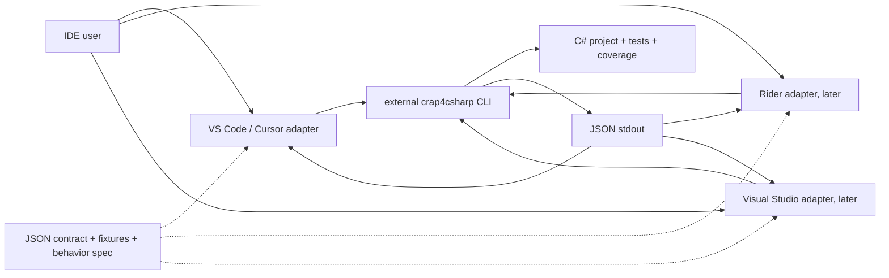
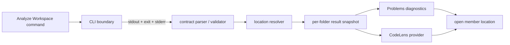

# `crapide` architecture spike

Status: proposed architecture for the standalone `crapide` project. This document lives in `crapide`; no IDE extension has been implemented. Read it with [ADR 001](adr/001-repository-structure.md), [ADR 002](adr/002-cross-ide-sharing.md), [ADR 003](adr/003-crap4csharp-integration.md), and the [implementation plan](implementation-plan.md).

## Context and decisions

`crap4csharp` remains an external CLI and the only authority for complexity, coverage, CRAP scores, and the strict `CRAP > 8.0` gate. `crapide` is the separate project root and is planned as a monorepo containing separately built IDE extensions. Its common layer is a documented JSON contract, fixtures, and behavioral expectations, not a cross-language runtime. JSON is the IDE input; SARIF remains available for CI interoperability. No IDE calculates or repairs CRAP values.

The available contract was inspected in the separate `crap4csharp` checkout: `src/Crap4CSharp/JsonReportFormatter.cs`, `CliApplication.cs`, their tests, and `README.md`. The upstream JSON contribution is awaiting review, so compatibility must be validated against a released/installed CLI before an extension is shipped. There is **no JSON schema-version field or CLI version field** in the current output. Do not manufacture either in parsed data.

## Current JSON contract and conceptual model

The initial document is `{ "members": [...] }`. Each member contains exactly these currently known fields:

| JSON field | Meaning for consumers |
| --- | --- |
| `name` | Qualified containing type plus member name. Not unique: overloads can share it. Includes methods and other executable C# members such as accessors, operators, conversions, finalizers, and custom event accessors. Constructors and bodyless members are not emitted. |
| `file` | String path relative to the CLI invocation directory where possible, with `/` separators; `null` if unavailable. A path may be absolute if relative conversion is impossible. |
| `startLine`, `endLine` | Nullable, **1-based**, inclusive source lines. No columns or syntax-span precision. |
| `complexity` | Integer cyclomatic complexity from the CLI. |
| `coveragePercent` | Number in 0–100 or `null` when unavailable. |
| `crap` | Unrounded number or `null` when unavailable. |

`members` may be empty. Ordering is CRAP descending with null scores last and deterministic location/name ties, but consumers should not use order as identity. The initial format has no explicit schema version, workspace identity, project identity, member kind, signature, columns, diagnostic severity, or analysis metadata. The extension's **analysis context** therefore holds the selected workspace-folder URI, CLI invocation directory, run state and errors; these are not JSON fields. A result is associated with one invocation and zero or more members. A member retains the original numeric values and its optional source range. Keep multiple records even if `name` and location coincide; do not silently deduplicate.

Identity for UI indexing is a per-run record plus resolved file URI and line range; `name` is a label, not a stable cross-run identifier. An overload can have the same name as another overload. `file: null` or unusable positions make a member unlocated: retain it in parsed results, but do not invent a file, diagnostic, CodeLens, or navigation target. Null coverage/CRAP is “unavailable,” not 0%. No threshold decision can be made for a null CRAP value. The CLI may emit a score even when a location is null; preserve that score without a source annotation.

## External CLI boundary

The desktop extension runs a user-installed, prebuilt CLI with argument-array process spawning and an explicit working directory. Preferred resolution is a configured command/executable path (including a supported `.dll` launched via `dotnet`); fallback is a `crap4csharp` executable on `PATH` when such a distribution exists. Never shell-concatenate a command, run `dotnet run` as the production integration, import `crap4csharp` source, or infer scores from coverage files. The adapter captures stdout as the JSON document, stderr as bounded diagnostic/progress text, and the exit code separately. Exit `0` and `2` can carry valid JSON; `2` means the CLI's existing threshold was exceeded. Exit `1` is a failed run without a report. The parser still verifies the actual document for `0`/`2` rather than trusting the exit alone. Details are fixed in [ADR 003](adr/003-crap4csharp-integration.md).

The local CLI's no-argument mode examines `src/` under its invocation directory. It resolves **one owning `.csproj` and one matching test project per run**, rejects files spanning projects, invokes `dotnet test`, and writes/deletes a `coverage/` directory under that invocation directory. The first IDE implementation invokes `--format json` once for each selected workspace folder, with that folder as cwd. A multi-root workspace gets one independent run per folder. A folder with multiple owning projects receives the CLI failure as an actionable limitation; the extension does not guess which project to analyze. A folder without `src/` can yield an empty successful report, so the UI must distinguish “no members returned” from an unsupported layout and explain that default discovery is `src/`. Multi-project traversal and alternate source layouts require a separate future design, preferably a CLI capability, not an improvised IDE-side project resolver. All runs are serial per folder to avoid racing over the same coverage directory.

The `coverage/` deletion is a material side effect of the current CLI; document it in extension help and show the actual invocation root before analysis. P5 should test that an existing user-owned `coverage/` directory cannot be silently treated as disposable: until the CLI exposes an isolated output location, the command should require an explicit confirmation when that directory already exists. This is a product safety boundary, not a request to modify the CLI during this spike.

## VS Code / Cursor MVP

The first adapter is a desktop Node.js VS Code extension running in the **workspace extension host**, so spawning the CLI takes place on the same machine as a local or remote workspace. Browser-only and virtual workspaces cannot run the external process in this MVP; display an unsupported-workspace explanation. Cursor initially uses this same extension and VS Code APIs; compatibility and installation are smoke-tested in Cursor. No Cursor-specific API is needed.

The single user command is **CRAP: Analyze Workspace**. It requires a trusted, file-backed workspace folder. If several folders are open, analyze each independently; no folder results are merged into a synthetic project score. The command resolves the CLI, checks the folder, serializes runs per folder, invokes the CLI, parses and validates JSON, resolves source locations, and atomically publishes the successful result for that folder. It reports failures with a short actionable message and keeps bounded stderr in an output channel. Starting a new run clears that folder's previous diagnostics and CodeLens data; a failed or cancelled run leaves no stale findings. Other folders' results remain intact. A duplicate invocation for the same folder is rejected or coalesced rather than racing. Command-only execution means no file watcher or background test run.

Only a **located** member with non-null `crap > 8.0` produces a Warning diagnostic, matching the CLI gate and its SARIF `CRAP001` rule. `8.0` exactly is not a finding. The diagnostic message includes the member name and CLI values; missing coverage is displayed as unavailable. A valid exit `2` with JSON may produce no *located* diagnostics if the offending record has no usable location; report that outcome clearly. Do not create severity tiers, individual method gates, or metrics from SARIF. Other located members may have CodeLens entries with CRAP, CC and coverage (using “N/A” for nulls). The CodeLens content is a presentation detail to tune in P6, not a new metric. Diagnostic and CodeLens selection should use the snapshot so editor requests never start the CLI.

For a relative `file`, resolve from the invocation directory and accept the target only if it stays within the corresponding workspace folder and maps to an existing regular `.cs` file. Absolute paths are accepted only when they are within that folder. Check the canonical target as well as lexical containment so a symlink cannot escape the folder. Normalize separators and use the host platform's path rules; never build a `file:` URI by string concatenation. If path mapping fails, retain the result without a source annotation. Convert `startLine` to a zero-based line index. Because JSON has no columns, anchor CodeLens/navigation at column 0 of the start line and use a full-line or start-line diagnostic range; `endLine` may bound the range if the document is available, but it is **not** a precise C# syntax span. Validate line order and bounds against the current document; if the file has changed since analysis, show that the location is approximate rather than searching by member name or silently moving the result. Navigation opens the resolved file at the start line. No extra C# parser is introduced for matching.

Keep the MVP to command, Problems, CodeLens, navigation, CLI discovery/configuration and actionable errors. No dashboards, charts, history, AI recommendations, refactoring, automatic modifications, watches, auto-analysis, cloud service, telemetry, Rider, or Visual Studio adapter. A source-less member has no UI list in the MVP beyond a concise run summary/output channel; the parsed result is preserved for future presentation choices.

## Future IDE adapters

Rider and Visual Studio use their own process, settings, document, and UI APIs while consuming the same JSON semantics and fixtures. JetBrains describes Rider's IntelliJ front end and ReSharper C# back end; this may affect how an eventual plugin presents inspections or editor annotations, but it does not require a shared runtime now. Microsoft exposes Visual Studio extension editor and diagnostic surfaces independently of VS Code. Decide each plugin's SDK and exact annotation API in its own implementation phase. The only imposed integration point is the CLI invocation/JSON boundary and behavioral conformance. See [JetBrains Rider plugin documentation](https://plugins.jetbrains.com/docs/intellij/rider.html) and [Visual Studio extensibility documentation](https://learn.microsoft.com/en-us/visualstudio/extensibility/index).

## Testing architecture

Canonical fixtures in the future `contracts/fixtures/json/` cover empty, normal, exact-threshold, over-threshold, null metrics/locations, overloads, accessors, Unicode/escaped names, and malformed or unsupported shapes. `contracts/behavior.md` records observable parser, path, error and presentation rules. Pure unit tests exercise parsing, validation, score-to-diagnostic mapping, line conversion, path containment, and folder snapshot behavior. A fake process runner exercises stdout/stderr/exit handling and cancellation without launching the real CLI. Extension-host integration tests exercise the command, Problems collection, CodeLens provider, navigation, trust restriction and multi-root isolation against fixtures. A small, separately marked end-to-end test runs a real published CLI on a disposable one-project C# fixture, checking both exit `0` and exit `2` with JSON; it is not required for every unit test. CI should include Windows, macOS and Linux for path and process behavior when the extension matures. VS Code documents extension-host testing in its [testing guide](https://code.visualstudio.com/api/working-with-extensions/testing-extension).

## Risks and focused validation

| Risk | Mitigation / phase |
| --- | --- |
| JSON contribution is not yet a released CLI contract and has no explicit version | P3 pins exact fixtures from the accepted CLI; P4/P7 give an unsupported-format error based on observed output. A future schema/version marker would need a CLI change. |
| `coverage/` is deleted at the invocation root | P5 warning/confirmation for an existing directory; future CLI output-directory option is the clean long-term fix. |
| Single-project and `src/` assumptions exclude common solution layouts | State limitation in MVP; validate real layouts before a separate multi-project phase. |
| No columns, member kind, signature or project ID in JSON | Line-level annotations only; retain duplicate records and context externally. Request upstream contract improvements only on demonstrated need. |
| Results can be stale after edits, and CLI invokes tests that may be slow | Manual runs, clear on rerun, mark approximate locations after edits; add timeout/cancellation through the runner, with bounded output. |
| Remote and Cursor environments differ | Workspace-host process model; smoke-test representative remote VS Code and Cursor before release. [VS Code extension-host guidance](https://code.visualstudio.com/api/advanced-topics/extension-host); [Cursor extension documentation](https://prod.cursor.com/help/customization/extensions). |
